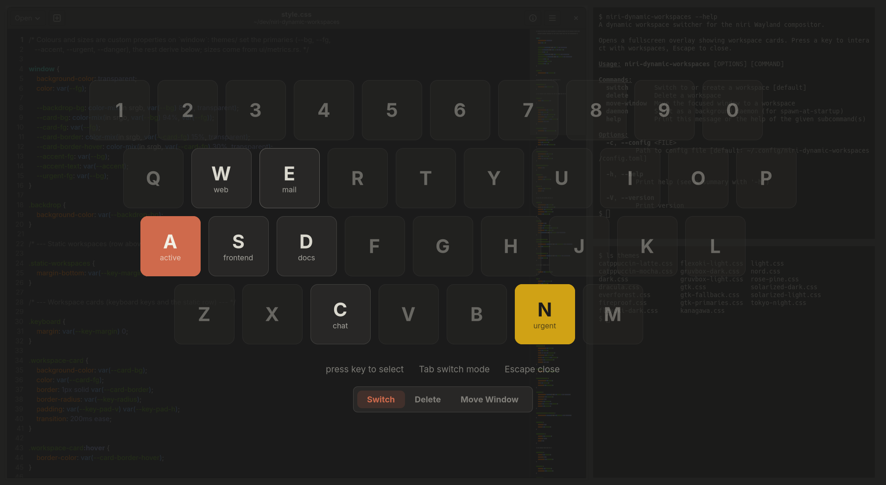

# niri-dynamic-workspaces



## Install

### Nix (flake)

```nix
# flake.nix inputs
niri-dynamic-workspaces.url = "github:nickolaj-jepsen/niri-dynamic-workspaces";
```

Build directly:

```bash
nix build github:nickolaj-jepsen/niri-dynamic-workspaces
nix run github:nickolaj-jepsen/niri-dynamic-workspaces
```

### Home Manager module

```nix
# Add to your Home Manager imports
imports = [ inputs.niri-dynamic-workspaces.homeModules.default ];

# Enable
programs.niri-dynamic-workspaces = {
  enable = true;
  keybind = "Mod+D";              # default — open switcher
  deleteKeybind = "Mod+Ctrl+D";  # default — open delete overlay
  moveWindowKeybind = "Mod+Shift+D"; # default — open move-window overlay
  daemon = true;                  # default — start daemon at login
  settings = {
    general.workspace_prefix = "dyn-";
  };
};
```

This installs the package, adds a niri keybind, and writes the config file.

### Cargo

Requires GTK4, gtk4-layer-shell, and pkg-config development headers.

```bash
cargo install --git https://github.com/nickolaj-jepsen/niri-dynamic-workspaces
```

## Configuration

Config file: `~/.config/niri-dynamic-workspaces/config.toml`

All fields are optional with sensible defaults.

```toml
[general]
workspace_prefix = "dyn-"          # prefix for dynamic workspace names
default_programs = ["kitty"]       # programs launched when creating any new workspace
auto_delete_empty = true           # daemon: auto-delete empty unfocused workspaces
hover_preview = true               # preview workspaces by hovering over cards
layout = "qwerty"                  # keyboard layout for the overlay (see table below)

[keybinds]
close = ["Escape", "Ctrl+c", "Ctrl+w", "Ctrl+q"]  # keys to dismiss the overlay

[workspace.a]                          # key: a-z or 0-9
name = "Browser"                       # optional display name shown on the key
programs = ["firefox", "slack"]        # programs launched on create (replaces defaults)
# Configured workspaces that don't exist yet appear as muted keys with a dashed border.

[workspace.b]
programs = ["kitty --title myterm"]    # arguments split with shell quoting rules
# Quote arguments containing spaces: ["kitty --title 'my term'"]. No shell is
# involved — quoting only groups words. Substituted {{variables}} are quoted
# automatically, so "code {{path}}" works with paths containing spaces.

[workspace.1]                          # digit workspaces work too
name = "Comms"
programs = ["slack", "discord"]
```

#### Templates

Templates let you choose from predefined program sets when creating a new workspace. When templates are defined and you press a key for a non-existing workspace, a picker appears instead of creating the workspace immediately.

```toml
[template.dev]
programs = ["kitty", "code {{path}}"]
key = "d"                        # optional hotkey shortcut
title = "{{path}}"               # optional workspace title (see below)

[template.dev.variables.path]
name = "Project path"            # display label shown in the input form
type = "text"                    # free-form input (default)

[template.dev.variables.branch]
name = "Git branch"
type = "options"                 # dropdown from static list
options = ["main", "develop", "staging"]

[template.dev.variables.tool]
name = "Build tool"
type = "command"                 # dropdown from shell command output
command = "ls ~/dev"             # each stdout line = one option

[template.dev.variables.project]
name = "Project"
type = "dir"                     # dropdown from directory scan
dirs = ["~/dev", "~/work"]       # directories to scan for child dirs
depth = 1                        # scan depth (default 1)

[template.browser]
programs = ["firefox", "slack"]
```

- Each template needs a `programs` list (templates with empty programs are skipped)
- The optional `key` field assigns a hotkey (a-z or 0-9) for quick selection in the picker
- Templates without a `key` get one auto-assigned (2-9 then a-z; `1` is reserved for the "Empty" option)
- The picker always includes an "Empty" option that uses `default_programs`
- Workspaces with per-key `[workspace.KEY].programs` skip the picker and create directly
- Templates can define **variables** with `{{name}}` placeholders in program strings
- Each variable has a required `name` (display label) and optional `type` (defaults to `"text"`)
- Variable types:
  - `"text"` — free-form text input (default); outputs whatever the user types
  - `"options"` — dropdown from a static list (`options` field); outputs the selected option string
  - `"command"` — dropdown from shell command output (`command` field); outputs the selected stdout line
  - `"dir"` — dropdown from directory scan (`dirs` field; hidden dirs excluded; `depth` controls scan depth, default 1); outputs the absolute path of the selected directory (e.g. `/home/user/dev/myproject`)
- If the source resolves to zero options at runtime, the variable falls back to free-form text input
- Templates with variables show an input form before creating the workspace
- Templates without variables create immediately as before
- The optional `title` field sets a display name on the workspace (shown on the key card):
  - Supports `{{var}}` substitution from template variables
  - If omitted and the template has variables, the first variable's value is used automatically
  - For `dir`-type variables, the basename is extracted (e.g. `/home/user/dev/myproject` → `myproject`)
  - The full workspace name becomes `{prefix}{key} {title}` (e.g. `dyn-a myproject`)

#### Hooks

Shell commands that run automatically when workspaces are created or deleted:

```toml
[hooks]
on_create = ['notify-send "Created $NDW_WORKSPACE_NAME"']
on_delete = ["cleanup-workspace.sh"]
```

- `on_create` / `on_delete` are arrays of shell commands run via `sh -c`
- Commands run in the background (fire-and-forget, non-blocking)
- Variables are passed as environment variables — use shell double quotes (not single quotes) to expand them
- Environment variables set for each hook:
  - `NDW_WORKSPACE_NAME` — full workspace name (e.g. `dyn-a`)
  - `NDW_WORKSPACE_KEY` — single character key (e.g. `a`)
  - `NDW_TEMPLATE` — template name if used (empty otherwise)
  - `NDW_VAR_<NAME>` — template variable values, uppercased (e.g. `NDW_VAR_PATH`)
- Templates can define additional `on_create` hooks that run after the global ones:

```toml
[template.dev]
programs = ["kitty", "code {{path}}"]
on_create = ['git -C "$NDW_VAR_PATH" status']

[template.dev.variables.path]
name = "Project path"
```

#### Available keyboard layouts

| Layout   | Value      |
|----------|------------|
| QWERTY   | `qwerty`   |
| AZERTY   | `azerty`   |
| QWERTZ   | `qwertz`   |
| Dvorak   | `dvorak`   |
| Colemak  | `colemak`  |

All layouts contain the same 36 keys (a–z, 0–9) arranged in the physical positions of each keyboard layout. The value is case-insensitive.

### Usage

- **`niri-dynamic-workspaces`** or **`niri-dynamic-workspaces switch`** — opens the switcher overlay (press key to switch/create)
- **`niri-dynamic-workspaces delete`** — opens the delete overlay (press key to delete)
- **`niri-dynamic-workspaces move-window`** — opens the move-window overlay (press key to move the focused window)
- **`niri-dynamic-workspaces daemon`** — starts as a background daemon (no overlay shown)

All modes support toggle behavior: running the same command again closes the overlay.

#### Direct mode (no overlay)

Pass a workspace key to act immediately without opening the overlay:

```bash
niri-dynamic-workspaces switch a        # switch to / create dyn-a
niri-dynamic-workspaces delete a        # delete dyn-a
niri-dynamic-workspaces move-window a   # move focused window to dyn-a
```

### Daemon mode

By default the overlay process starts fresh each time a keybind is pressed, which includes GTK and CSS initialization. For faster overlay display, start a background daemon at login:

```
spawn-at-startup "niri-dynamic-workspaces" "daemon"
```

The daemon keeps GTK initialized and subsequent `switch`/`delete`/`move-window` invocations are forwarded to it over D-Bus, skipping startup overhead.

Config changes are picked up automatically: the daemon re-reads the config file when it changes, so no restart is needed after editing it.

The Home Manager module enables daemon mode by default. To disable it:

```nix
programs.niri-dynamic-workspaces.daemon = false;
```

## Development

Enter the dev shell and build:

```bash
nix develop
cargo build
```

Lint and test:

```bash
cargo fmt -- --check   # check formatting
cargo clippy           # lint (clippy all + pedantic)
cargo test             # run unit tests
```
