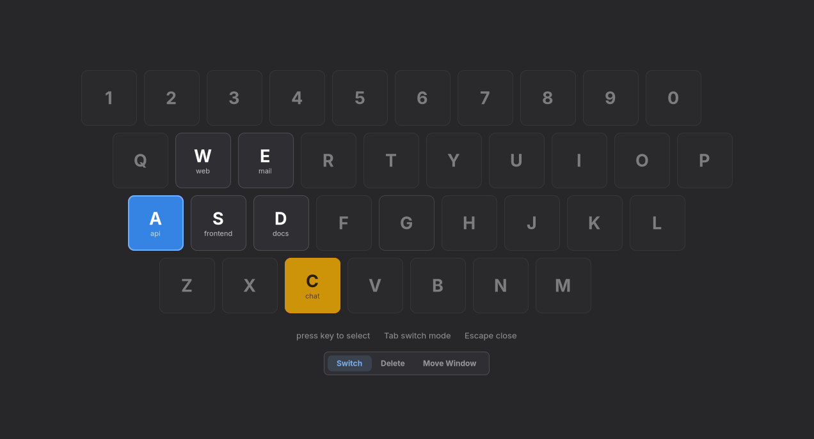

# niri-dynamic-workspaces

A keyboard-driven workspace switcher for the [niri](https://github.com/YaLTeR/niri)
Wayland compositor. A keybind shows your workspaces on a keyboard-shaped grid;
press a letter or digit to switch to that workspace, or to create it and launch
its programs. The same overlay deletes workspaces and moves the focused window.


## Install

### Nix (flake)

```nix
# flake.nix inputs
niri-dynamic-workspaces.url = "github:nickolaj-jepsen/niri-dynamic-workspaces";
```

Build directly:

```bash
nix build github:nickolaj-jepsen/niri-dynamic-workspaces
nix run github:nickolaj-jepsen/niri-dynamic-workspaces
```

### Home Manager module

```nix
# Add to your Home Manager imports
imports = [ inputs.niri-dynamic-workspaces.homeModules.default ];

# Enable
programs.niri-dynamic-workspaces = {
  enable = true;
  keybind = "Mod+D";              # default — open switcher (null to skip)
  deleteKeybind = "Mod+Ctrl+D";  # default — open delete overlay (null to skip)
  moveWindowKeybind = "Mod+Shift+D"; # default — open move-window overlay (null to skip)
  daemon = true;                  # default — start daemon at login
  settings = {
    general.workspace_prefix = "dyn-";
  };
  # Optional: a theme file, written next to the config and selected for you
  themeCss = ''
    window { --accent: #89b4fa; }
  '';
};
```

The module installs the package, writes the config file and runs the daemon.

The keybinds go into `programs.niri.settings.binds` when the Home Manager module
from [sodiboo/niri-flake](https://github.com/sodiboo/niri-flake) is loaded
(niri-flake's NixOS module loads it for you). Set a keybind to `null` to skip
it. If niri-flake is loaded but you write `config.kdl` yourself, set all three
to `null`: any bind makes niri-flake generate the whole file.

Without niri-flake, with Home Manager's own `wayland.windowManager.niri`, or
with niri-flake's raw `programs.niri.config` (which overrides `settings`), the
binds never reach niri; add the ones from [Keybinds](#keybinds) yourself.

### Cargo

Requires GTK4, GLib 2.80 or newer, gtk4-layer-shell, and pkg-config development headers.

```bash
cargo install --git https://github.com/nickolaj-jepsen/niri-dynamic-workspaces
```

### Keybinds

Add the three modes to the `binds` block of niri's `config.kdl`:

```kdl
binds {
    Mod+D hotkey-overlay-title="Open Workspace Switcher" { spawn "niri-dynamic-workspaces"; }
    Mod+Ctrl+D hotkey-overlay-title="Delete Workspace" { spawn "niri-dynamic-workspaces" "delete"; }
    Mod+Shift+D hotkey-overlay-title="Move Window to Workspace" { spawn "niri-dynamic-workspaces" "move-window"; }
}
```

niri's default config already binds Mod+D to fuzzel, and niri refuses a config
with duplicate keybinds, so remove that line or pick another key. For a faster
overlay, also start the daemon at login (see [Daemon mode](#daemon-mode)).

## Configuration

Config file: `~/.config/niri-dynamic-workspaces/config.toml`

All fields are optional with sensible defaults.

```toml
[general]
workspace_prefix = "dyn-"          # prefix for dynamic workspace names
default_programs = ["kitty"]       # programs launched when creating any new workspace
auto_delete_empty = true           # daemon: auto-delete empty unfocused workspaces
hover_preview = true               # preview workspaces by hovering over cards
hide_empty_static = false          # hide empty workspaces from the row above the
                                   # keyboard (focused/urgent ones stay visible)
inhibit_compositor_shortcuts = true # suppress niri keybinds while the overlay is
                                   # open, so a still-held Mod+<key> reaches the
                                   # overlay instead of firing compositor binds
                                   # (binds with allow-inhibiting=false still fire)
layout = "qwerty"                  # arrangement of the drawn keys (see table
                                   # below); presses follow your XKB layout
theme = "gtk"                      # follows your GTK theme; or a built-in palette
                                   # ("dark", "nord", …) or a CSS file (see Theming)

[keybinds]
close = ["Escape", "Ctrl+c", "Ctrl+w", "Ctrl+q"]  # keys to dismiss the overlay
                                                  # (GTK key names; Caps Lock is
                                                  # ignored, "Ctrl+Shift+q" works)

[workspace.a]                          # key: a-z or 0-9
name = "Browser"                       # optional display name shown on the key
programs = ["firefox", "slack"]        # programs launched on create (replaces defaults)
# Configured workspaces that don't exist yet appear as muted keys.

[workspace.b]
programs = ["kitty --title myterm"]    # arguments split with shell quoting rules
# Quote arguments containing spaces: ["kitty --title 'my term'"]. No shell is
# involved — quoting only groups words. {{variables}} are filled in after the
# split, so a value never breaks out of its argument: "code {{path}}" and
# "kitty --title 'ws: {{path}}'" both work with paths containing spaces.

[workspace.1]                          # digit workspaces work too
name = "Comms"
programs = ["slack", "discord"]

[workspace.q]
static = "01"                          # pin an existing niri workspace to this key
name = "Main"                          # optional display name shown on the key
```

#### Program order

When a new workspace starts two or more programs, their columns are put in
list order once the windows appear. Each window is matched to its program by
app id: through the executable name (`firefox` for `org.mozilla.firefox`) or,
for a wrapper, a later argument (`flatpak run com.slack.Slack`,
`uwsm app -- kitty`, `sh -c 'sleep 1; exec foot'`). A window that matches no
program keeps niri's placement, and nothing is moved once you switch to
another workspace.

#### Static workspace mappings

If you have fixed named workspaces in your niri config (e.g. `workspace "01"`
bound to `Mod+Q`), `static = "<name>"` pins that workspace to the same key in
the overlay, mirroring your compositor keybinds. Pinned workspaces appear on
their key instead of in the row above the keyboard.

- Switch and move-window act on the existing workspace directly; nothing is created
- Delete mode is disabled for pinned keys (remove the workspace from your niri config instead)
- `programs` has no effect on a pinned key and produces a warning
- Empty pinned workspaces appear dimmed in switch mode (the key still works)
- Urgent windows highlight the key, like any other workspace card
- If the named workspace doesn't exist, the key appears disabled and pressing it shows an error
- Names match case-insensitively, as in niri

#### Templates

Templates let you choose from predefined program sets when creating a new workspace. When templates are defined and you press a key for a non-existing workspace, a picker appears instead of creating the workspace immediately.

```toml
[template.dev]
programs = ["kitty", "code {{path}}"]
key = "d"                        # optional hotkey shortcut
title = "{{path}}"               # optional workspace title (see below)

[template.dev.variables.path]
name = "Project path"            # display label shown in the input form
type = "text"                    # free-form input (default)

[template.dev.variables.branch]
name = "Git branch"
type = "options"                 # dropdown from static list
options = ["main", "develop", "staging"]

[template.dev.variables.tool]
name = "Build tool"
type = "command"                 # dropdown from shell command output
command = "ls ~/dev"             # each stdout line = one option

[template.dev.variables.project]
name = "Project"
type = "dir"                     # dropdown from directory scan
dirs = ["~/dev", "~/work"]       # directories to scan for child dirs
depth = 1                        # scan depth (default 1)

[template.browser]
programs = ["firefox", "slack"]
```

- Each template needs a `programs` list (templates with empty programs are skipped)
- The optional `key` field assigns a hotkey (a-z or 0-9) for quick selection in the picker
- Templates without a `key` get one auto-assigned (2-9 then a-z; `1` is reserved for the "Empty" option)
- The picker always includes an "Empty" option that uses `default_programs`
- Workspaces with per-key `[workspace.KEY].programs` skip the picker and create directly
- Templates can define **variables** with `{{name}}` placeholders in program strings
- Each variable has a required `name` (display label) and optional `type` (defaults to `"text"`)
- Variable types:
  - `"text"` — free-form text input (default); outputs whatever the user types
  - `"options"` — dropdown from a static list (`options` field); outputs the selected option string
  - `"command"` — dropdown from shell command output (`command` field); outputs the selected stdout line
  - `"dir"` — dropdown from directory scan (`dirs` field; hidden dirs excluded; `depth` controls scan depth, default 1); outputs the absolute path of the selected directory (e.g. `/home/user/dev/myproject`)
- If the source resolves to zero options at runtime, the variable falls back to free-form text input
- Templates with variables show an input form before creating the workspace
- Templates without variables create immediately as before
- The optional `title` field sets a display name on the workspace (shown on the key card):
  - Supports `{{var}}` substitution from template variables
  - If omitted and the template has variables, the first variable's value is used automatically
  - For `dir`-type variables, the basename is extracted (e.g. `/home/user/dev/myproject` → `myproject`)
  - The full workspace name becomes `{prefix}{key} {title}` (e.g. `dyn-a myproject`)

#### Hooks

Shell commands that run automatically when workspaces are created or deleted:

```toml
[hooks]
on_create = ['notify-send "Created $NDW_WORKSPACE_NAME"']
on_delete = ["cleanup-workspace.sh"]
```

- `on_create` / `on_delete` are arrays of shell commands, each run with `sh -c`
- `on_create` runs whenever a workspace is created, also by `move-window`
- `on_delete` runs whenever a workspace is deleted, also when the daemon
  removes an empty one (`auto_delete_empty`); `NDW_TEMPLATE` is empty and no
  `NDW_VAR_*` are set for it
- Deleting a workspace asks its windows to close and runs `on_delete` once
  they have. If one is still open after 5 seconds (an editor asking to save,
  a terminal with a running job), the workspace keeps its name and `on_delete`
  does not run
- niri launches them, like `programs`: they get niri's environment and
  working directory, keep running after the overlay closes, and are not part
  of the daemon's service
- An event's commands run one after another in the background; one that fails
  does not stop the next
- Their output is discarded; to debug a hook, redirect it
  (`my-hook >>/tmp/ndw-hooks.log 2>&1`)
- Variables are passed as environment variables — use shell double quotes (not single quotes) to expand them
- Environment variables set for each hook:
  - `NDW_WORKSPACE_NAME` — full workspace name, title included (e.g. `dyn-a My Project`)
  - `NDW_WORKSPACE_KEY` — single character key (e.g. `a`)
  - `NDW_TEMPLATE` — template name if used (empty otherwise)
  - `NDW_VAR_<NAME>` — template variable values. The name is uppercased and
    any character other than an ASCII letter or digit becomes `_` (`path` →
    `NDW_VAR_PATH`, `project-dir` → `NDW_VAR_PROJECT_DIR`); variables that
    map to the same name produce a config warning
- Templates can define additional `on_create` hooks that run after the global
  ones when the template creates a workspace:

```toml
[template.dev]
programs = ["kitty", "code {{path}}"]
on_create = ['git -C "$NDW_VAR_PATH" status']

[template.dev.variables.path]
name = "Project path"
```

#### Available keyboard layouts

| Layout   | Value      |
|----------|------------|
| QWERTY   | `qwerty`   |
| AZERTY   | `azerty`   |
| QWERTZ   | `qwertz`   |
| Dvorak   | `dvorak`   |
| Colemak  | `colemak`  |

All layouts contain the same 36 keys (a–z, 0–9) arranged in the physical positions of each keyboard layout. The value is case-insensitive.

`layout` only arranges the drawing. A key press selects the character the key
types. A key that types none of them (AZERTY's unshifted digits, a Cyrillic
letter) selects the one it carries at another level or in another group of your
keymap, so a non-Latin layout needs a Latin one next to it (niri
`layout "us,ru"`).

### Theming



Every theme is rendered in the [theme gallery](docs/themes.md).

`general.theme` picks the palette:

| Value | Result |
|-------|--------|
| `"gtk"` (default) | Follows your GTK theme, including libadwaita-style colours defined in `~/.config/gtk-4.0/gtk.css` (matugen, stylix, adw-gtk3, …). Themes without those names get them derived from GTK's core colours. |
| `"dark"`, `"light"` | Self-contained neutral palettes that ignore the GTK theme. |
| a palette name | `catppuccin-mocha`, `catppuccin-latte`, `gruvbox-dark`, `gruvbox-light`, `nord`, `dracula`, `tokyo-night`, `rose-pine`, `everforest`, `kanagawa`, `solarized-dark`, `solarized-light`, `flexoki-dark`, `flexoki-light`, `fireproof` — all shown in the [gallery](docs/themes.md). |
| a path | Your own CSS file. Anything containing `/` or ending in `.css` is a path; `~/` is expanded and relative paths start at the config file's directory. |

A theme file is ordinary [GTK CSS](https://docs.gtk.org/gtk4/css-properties.html) and only needs what it changes: primaries it leaves out still come from the GTK theme. It is re-read every time the overlay opens, daemon included; CSS errors are shown on a line under the overlay's hints and printed on stderr, and the rest of the file still applies.

```css
/* ~/.config/niri-dynamic-workspaces/mocha.css, with theme = "mocha.css" */
window {
    --bg: #1e1e2e;
    --fg: #cdd6f4;
    --accent: #89b4fa;
    --urgent: #f9e2af;
    --danger: #f38ba8;
}
```

[`themes/dark.css`](themes/dark.css) is a complete palette to copy from. To contribute one, add `themes/<name>.css` — every file there becomes a built-in name — and run `./e2e/render-themes.sh`.

#### Variables

All variables are set on `window`. The five primaries are enough for a full theme; the derived ones follow them unless you set them too.

| Primary | Used for |
|---------|----------|
| `--bg` | backdrop and base surface |
| `--fg` | text |
| `--accent` | focused workspace, selection |
| `--urgent` | urgent workspace |
| `--danger` | delete mode, errors |

| Derived | Default |
|---------|---------|
| `--backdrop-bg` | `--bg` at 85% opacity |
| `--card-bg` | `--bg` with 6% `--fg` mixed in |
| `--card-fg` | `--fg` |
| `--card-border`, `--card-border-hover` | `--card-fg` at 15% / 30% opacity |
| `--accent-fg` | `--bg` (text on `--accent`) |
| `--accent-text` | `--accent` (accent used as a text colour) |
| `--urgent-fg` | `--bg` (text on `--urgent`) |

Under `theme = "gtk"`, `--card-bg`, `--card-fg`, `--accent-fg`, `--accent-text` and `--urgent-fg` come from the GTK theme instead.

Sizes scale with the monitor and are regenerated on every open, but a theme file wins over them: `--key-radius`, `--key-margin`, `--key-pad-v`, `--key-pad-h`, `--section-gap`, `--tab-radius`, `--tab-pad-h`, `--option-min-width`, and the font sizes `--font-char`, `--font-name`, `--font-detail`, `--font-tab`, `--font-footer`.

```css
window { --key-radius: 0; --backdrop-bg: rgba(0, 0, 0, 0.6); }
```

#### Classes

For anything variables can't express, style the widgets directly.

| Selector | Widget |
|----------|--------|
| `window.mode-switch`, `.mode-delete`, `.mode-move-window` | the overlay, by current mode |
| `.backdrop` | full-screen background |
| `.content` | centred container of the current view |
| `.static-workspaces`, `.keyboard`, `.keyboard-row` | the row of static workspaces, the key grid and its rows |
| `.workspace-card` | a key or a static workspace; contains `.card-title` and `.card-name` |
| `.mode-tabs`, `.mode-tab` | mode bar; tabs carry `.switch`, `.delete` or `.move-window`, plus `.active` |
| `.hints`, `.hint`, `.error-message` | footer hints and the error line |
| `.config-message` | the line under the hints naming config and theme problems; also carries `.error-message` |
| `.template-picker` | template view: `.template-title`, `.template-list`, `.template-option` (`.selected`) with `.template-key`, `.template-name`, `.template-programs` |
| `.variable-prompt` | variable view: `.variable-title`, `.variable-form`, `.variable-row`, `.variable-label`, `.variable-entry` (`.loading`) |
| `.fuzzy-list`, `.fuzzy-option` (`.selected`), `.fuzzy-more` | select-variable options |

`.workspace-card` states: `.static` or `.dynamic`; `.uncreated`, `.empty` or `.occupied`; `.focused`; `.active` (focused, or the visible workspace of another output); `.urgent`; `.disabled` (not a valid target in the current mode).

```css
window.mode-delete .backdrop { background-color: rgba(60, 0, 0, 0.85); }
.workspace-card.uncreated { border-style: dashed; }
@media (prefers-color-scheme: light) { window { --accent: #1c71d8; } }  /* GTK 4.20+ */
```

Variable and class names are covered by semver. The widget tree between them is not, so prefer class selectors over child combinators.

### Usage

- **`niri-dynamic-workspaces`** or **`niri-dynamic-workspaces switch`** — opens the switcher overlay (press key to switch/create)
- **`niri-dynamic-workspaces delete`** — opens the delete overlay (press key to delete)
- **`niri-dynamic-workspaces move-window`** — opens the move-window overlay (press a key to move the window that was focused when it opened)
- **`niri-dynamic-workspaces daemon`** — starts as a background daemon (no overlay shown)
- **`niri-dynamic-workspaces check`** — lists config problems and exits non-zero if there are any; needs no display

Every command takes `-c/--config FILE` to read another config file.

Running the same command while its overlay is open closes the overlay, and
running another mode's command switches the open overlay to that mode. Keybinds
behave differently: with `inhibit_compositor_shortcuts` (on by default) the open
overlay receives niri's keybinds as plain keys, so pressing Mod+D again selects
workspace d. Press Escape to close the overlay.

While open, the overlay tracks the compositor live: it follows the focused output across monitors and refreshes its cards when workspaces or windows change.

#### Direct mode (no overlay)

Pass a workspace key to act immediately without opening the overlay:

```bash
niri-dynamic-workspaces switch a        # switch to / create dyn-a
niri-dynamic-workspaces delete a        # close dyn-a's windows, then delete it
niri-dynamic-workspaces move-window a   # move focused window to dyn-a
```

Errors and config warnings are printed in the invoking terminal, and a failed
action exits non-zero, also when a daemon handles the call. A relative
`--config` path is resolved against the caller's directory.

`delete` returns only after the windows have closed and the name is gone, so
`delete a && switch a` creates a fresh dyn-a. If a window is still open after
5 seconds, the workspace keeps its name and the command fails.

### Daemon mode

By default the overlay process starts fresh each time a keybind is pressed, which includes GTK and CSS initialization. For faster overlay display, start a background daemon at login:

```
spawn-at-startup "niri-dynamic-workspaces" "daemon"
```

The daemon keeps GTK initialized and subsequent `switch`/`delete`/`move-window` invocations are forwarded to it over D-Bus, skipping startup overhead.

With `auto_delete_empty`, the daemon also removes dynamic workspaces that are empty and unfocused, running the `on_delete` hooks for each. A workspace created with programs is left alone for its first 15 seconds, so switching away while they start does not remove it. The workspace the overlay was opened from is left alone until the overlay closes, so a hover preview can still return to it.

Config changes are picked up automatically: the daemon reloads the config file whenever its contents change, including on a Home Manager switch, so no restart is needed. If an edit breaks the file, auto-delete keeps following the last config that loaded, while the overlay opens with the defaults and names the problem.

The Home Manager module enables daemon mode by default, as a user service that
starts with `graphical-session.target`. The service is skipped unless niri has
exported `NIRI_SOCKET` to the systemd user environment, as `niri --session`
does under niri-session or uwsm, so other desktop sessions don't start it. To
disable it:

```nix
programs.niri-dynamic-workspaces.daemon = false;
```

### Troubleshooting

Config problems are shown on a line under the overlay's hints and printed in
the invoking terminal; a file that does not parse falls back to the defaults.
`niri-dynamic-workspaces check` lists every problem. The daemon logs to stderr,
which for the Home Manager service is
`journalctl --user -u niri-dynamic-workspaces`.

## Development

Enter the dev shell and build:

```bash
nix develop
cargo build
```

Lint and test:

```bash
cargo fmt -- --check   # check formatting
cargo clippy           # lint (clippy all + pedantic)
cargo test             # run unit tests
nix flake check        # build the Nix package, check the Home Manager module
```

### End-to-end tests

`e2e/` runs the overlay inside a nested headless niri and drives it with clicks,
key presses and screenshots, so the IPC choreography is exercised against a real
compositor:

```bash
cargo build
./e2e/test.sh
```

See [e2e/README.md](e2e/README.md) for the harness verbs, how to drive a session
by hand, and how key presses are injected.

### Testing against a running daemon

An invocation is forwarded over D-Bus to whichever process owns the application
id, so a locally built overlay would otherwise be drawn by an installed daemon.
Debug builds (`cargo build`, `cargo run`) use
`dev.nickolaj.niri-dynamic-workspaces.Devel` instead.

To test a release build alongside an installed one, override the id:

```bash
NDW_APP_ID=dev.nickolaj.niri-dynamic-workspaces.Test ./target/release/niri-dynamic-workspaces
```
