<!-- Generated by e2e/render-themes.sh; do not edit. -->
# Theme gallery

Set `general.theme` to one of the built-in names, or to the path of a CSS
file. See [Theming](../README.md#theming) for the variables and classes.

## gtk, under a dark GTK theme

```toml
[general]
theme = "gtk"
```


## gtk, under a light GTK theme

```toml
[general]
theme = "gtk"
```


## catppuccin-latte

```toml
[general]
theme = "catppuccin-latte"
```

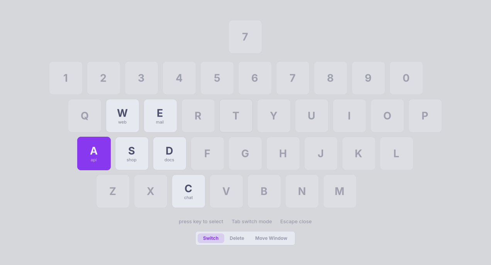

<details>
<summary><code>themes/catppuccin-latte.css</code></summary>

```css
/* Catppuccin Latte — https://catppuccin.com/palette */

window {
    --bg: #eff1f5;
    --fg: #4c4f69;
    --accent: #8839ef;
    --urgent: #df8e1d;
    --danger: #d20f39;

    --card-bg: #e6e9ef;
    --urgent-fg: #4c4f69;
}
```

</details>

## catppuccin-mocha

```toml
[general]
theme = "catppuccin-mocha"
```

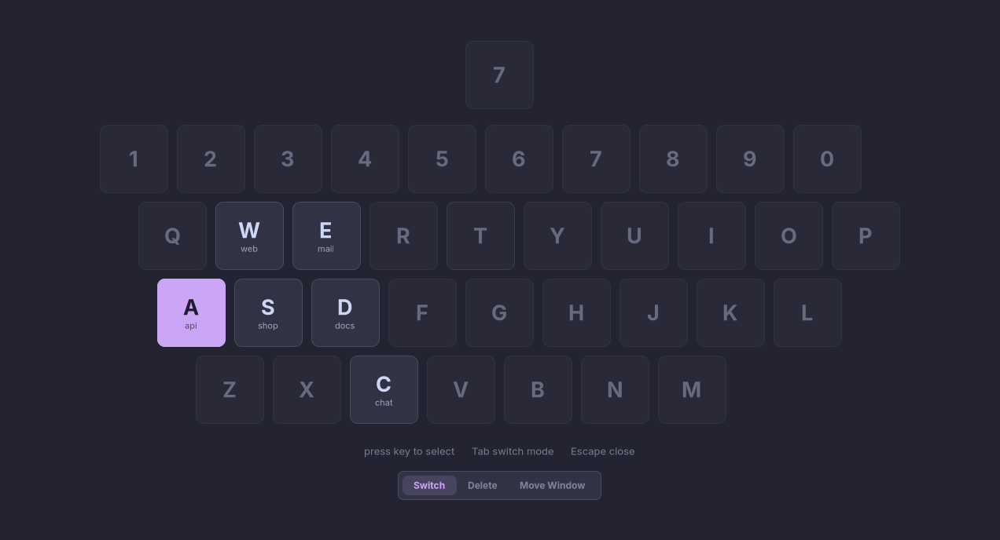

<details>
<summary><code>themes/catppuccin-mocha.css</code></summary>

```css
/* Catppuccin Mocha — https://catppuccin.com/palette */

window {
    --bg: #1e1e2e;
    --fg: #cdd6f4;
    --accent: #cba6f7;
    --urgent: #f9e2af;
    --danger: #f38ba8;

    --card-bg: #313244;
}
```

</details>

## dark

```toml
[general]
theme = "dark"
```


<details>
<summary><code>themes/dark.css</code></summary>

```css
/* A neutral palette that ignores the GTK theme. */

window {
    --bg: #222226;
    --fg: #ffffff;
    --accent: #3584e4;
    --urgent: #cd9309;
    --danger: #ff7b63;

    --accent-fg: #ffffff;
    --accent-text: #78aeed;
    --urgent-fg: rgba(0, 0, 0, 0.8);
}
```

</details>

## dracula

```toml
[general]
theme = "dracula"
```


<details>
<summary><code>themes/dracula.css</code></summary>

```css
/* Dracula — https://draculatheme.com */

window {
    --bg: #282a36;
    --fg: #f8f8f2;
    --accent: #bd93f9;
    --urgent: #ffb86c;
    --danger: #ff5555;

    --card-bg: #343746;
}
```

</details>

## everforest

```toml
[general]
theme = "everforest"
```

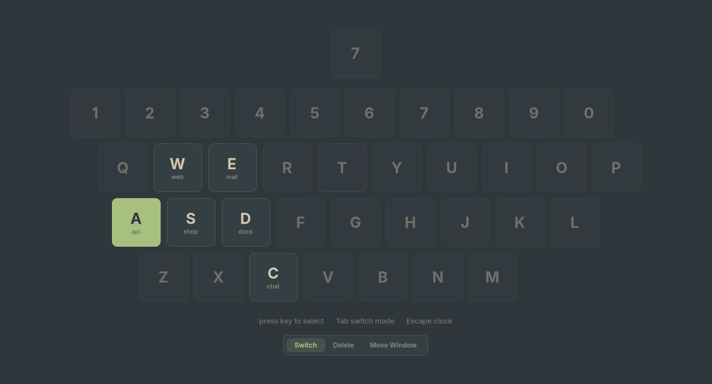

<details>
<summary><code>themes/everforest.css</code></summary>

```css
/* Everforest dark (medium) — https://github.com/sainnhe/everforest */

window {
    --bg: #2d353b;
    --fg: #d3c6aa;
    --accent: #a7c080;
    --urgent: #dbbc7f;
    --danger: #e67e80;

    --card-bg: #343f44;
}
```

</details>

## flexoki-dark

```toml
[general]
theme = "flexoki-dark"
```

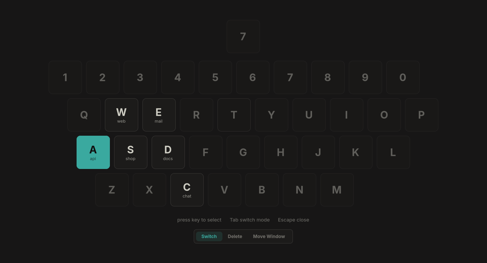

<details>
<summary><code>themes/flexoki-dark.css</code></summary>

```css
/* Flexoki dark — https://stephango.com/flexoki */

window {
    --bg: #100f0f;
    --fg: #cecdc3;
    --accent: #3aa99f;
    --urgent: #da702c;
    --danger: #d14d41;

    --card-bg: #1c1b1a;
}
```

</details>

## flexoki-light

```toml
[general]
theme = "flexoki-light"
```

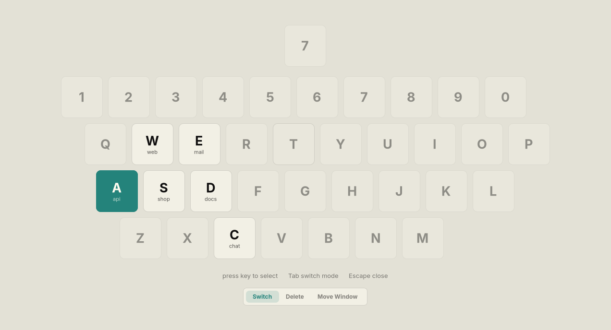

<details>
<summary><code>themes/flexoki-light.css</code></summary>

```css
/* Flexoki light — https://stephango.com/flexoki */

window {
    --bg: #fffcf0;
    --fg: #100f0f;
    --accent: #24837b;
    --urgent: #bc5215;
    --danger: #af3029;

    --card-bg: #f2f0e5;
}
```

</details>

## gruvbox-dark

```toml
[general]
theme = "gruvbox-dark"
```

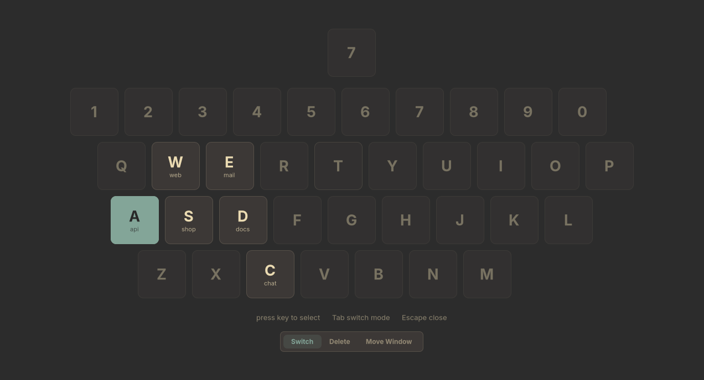

<details>
<summary><code>themes/gruvbox-dark.css</code></summary>

```css
/* Gruvbox dark — https://github.com/morhetz/gruvbox */

window {
    --bg: #282828;
    --fg: #ebdbb2;
    --accent: #83a598;
    --urgent: #fabd2f;
    --danger: #fb4934;

    --card-bg: #3c3836;
}
```

</details>

## gruvbox-light

```toml
[general]
theme = "gruvbox-light"
```

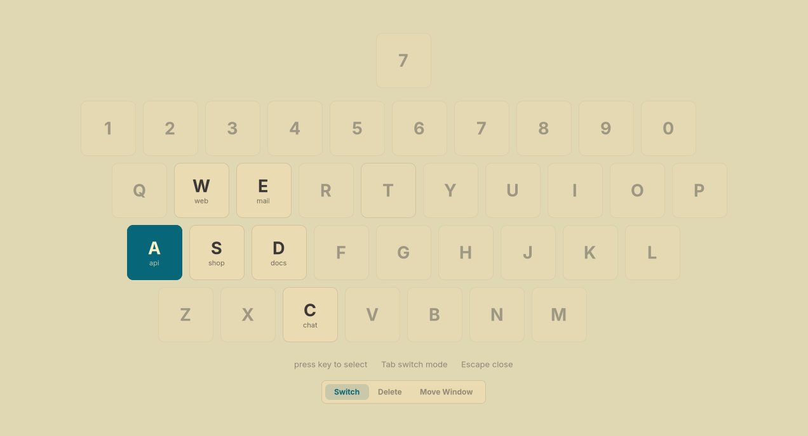

<details>
<summary><code>themes/gruvbox-light.css</code></summary>

```css
/* Gruvbox light — https://github.com/morhetz/gruvbox */

window {
    --bg: #fbf1c7;
    --fg: #3c3836;
    --accent: #076678;
    --urgent: #b57614;
    --danger: #9d0006;

    --card-bg: #ebdbb2;
}
```

</details>

## kanagawa

```toml
[general]
theme = "kanagawa"
```


<details>
<summary><code>themes/kanagawa.css</code></summary>

```css
/* Kanagawa Wave — https://github.com/rebelot/kanagawa.nvim */

window {
    --bg: #1f1f28;
    --fg: #dcd7ba;
    --accent: #7e9cd8;
    --urgent: #ff9e3b;
    --danger: #e82424;

    --card-bg: #2a2a37;
}
```

</details>

## light

```toml
[general]
theme = "light"
```


<details>
<summary><code>themes/light.css</code></summary>

```css
/* A neutral palette that ignores the GTK theme. */

window {
    --bg: #fafafb;
    --fg: #2e2e33;
    --accent: #3584e4;
    --urgent: #e5a50a;
    --danger: #c01c28;

    --card-bg: #ffffff;
    --accent-fg: #ffffff;
    --accent-text: #1c71d8;
    --urgent-fg: rgba(0, 0, 0, 0.8);
}
```

</details>

## nord

```toml
[general]
theme = "nord"
```


<details>
<summary><code>themes/nord.css</code></summary>

```css
/* Nord — https://www.nordtheme.com */

window {
    --bg: #2e3440;
    --fg: #d8dee9;
    --accent: #88c0d0;
    --urgent: #ebcb8b;
    --danger: #bf616a;

    --card-bg: #3b4252;
}
```

</details>

## rose-pine

```toml
[general]
theme = "rose-pine"
```

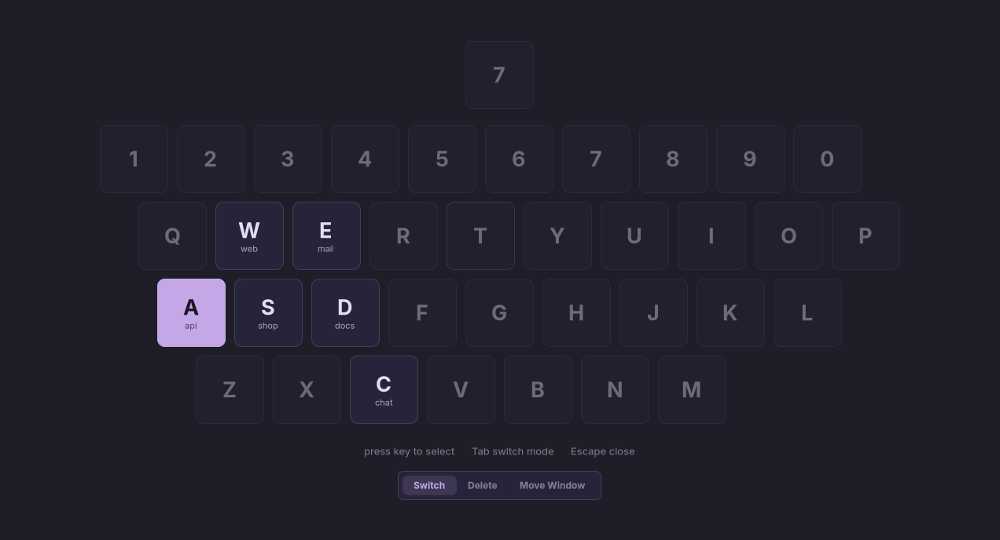

<details>
<summary><code>themes/rose-pine.css</code></summary>

```css
/* Rosé Pine — https://rosepinetheme.com */

window {
    --bg: #191724;
    --fg: #e0def4;
    --accent: #c4a7e7;
    --urgent: #f6c177;
    --danger: #eb6f92;

    --card-bg: #26233a;
}
```

</details>

## solarized-dark

```toml
[general]
theme = "solarized-dark"
```

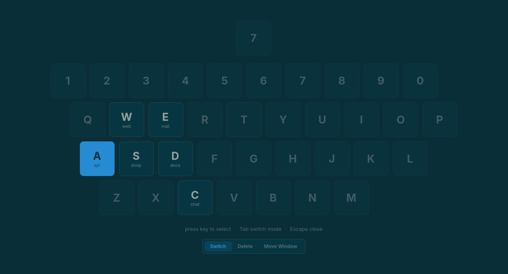

<details>
<summary><code>themes/solarized-dark.css</code></summary>

```css
/* Solarized dark — https://ethanschoonover.com/solarized */

window {
    --bg: #002b36;
    --fg: #93a1a1;
    --accent: #268bd2;
    --urgent: #b58900;
    --danger: #dc322f;

    --card-bg: #073642;
}
```

</details>

## solarized-light

```toml
[general]
theme = "solarized-light"
```

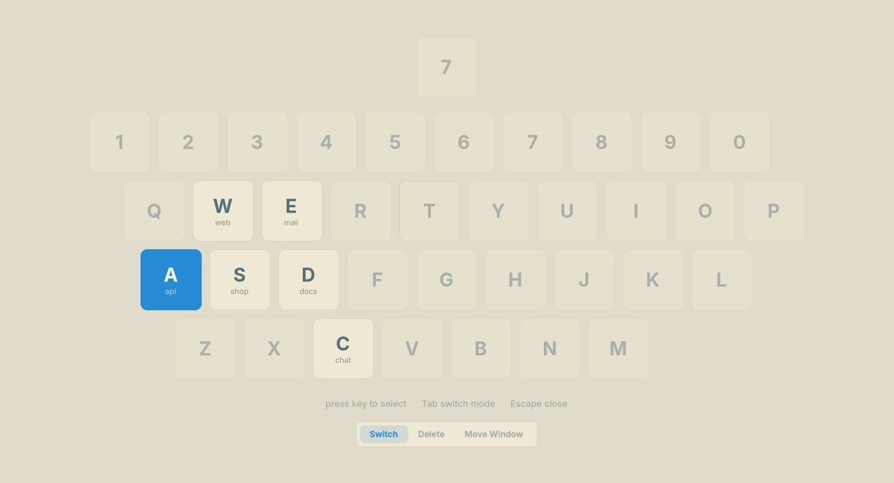

<details>
<summary><code>themes/solarized-light.css</code></summary>

```css
/* Solarized light — https://ethanschoonover.com/solarized */

window {
    --bg: #fdf6e3;
    --fg: #586e75;
    --accent: #268bd2;
    --urgent: #b58900;
    --danger: #dc322f;

    --card-bg: #eee8d5;
}
```

</details>

## tokyo-night

```toml
[general]
theme = "tokyo-night"
```

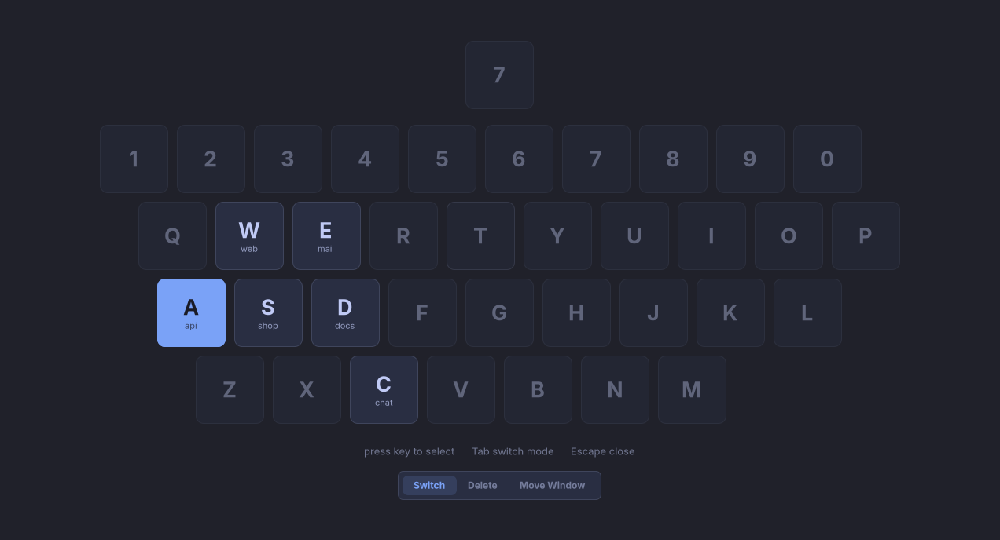

<details>
<summary><code>themes/tokyo-night.css</code></summary>

```css
/* Tokyo Night — https://github.com/folke/tokyonight.nvim */

window {
    --bg: #1a1b26;
    --fg: #c0caf5;
    --accent: #7aa2f7;
    --urgent: #e0af68;
    --danger: #f7768e;

    --card-bg: #292e42;
}
```

</details>
