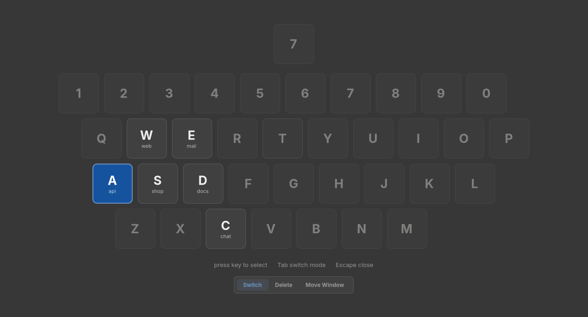
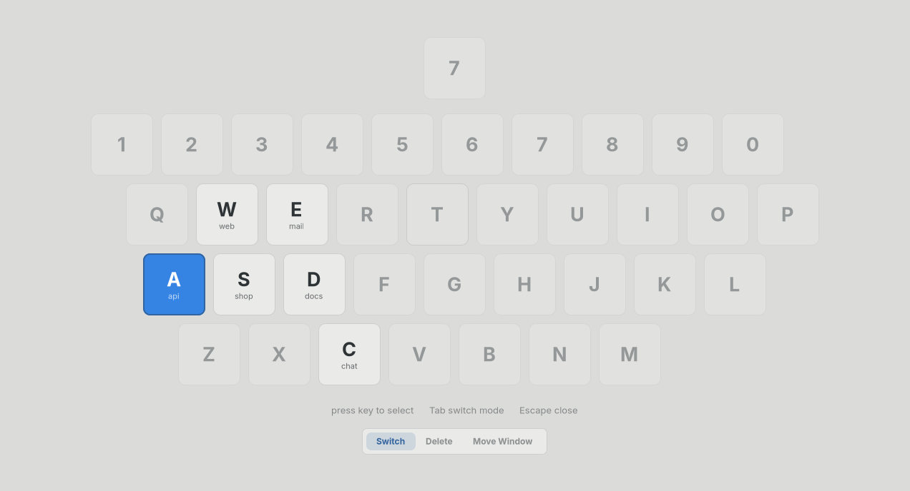
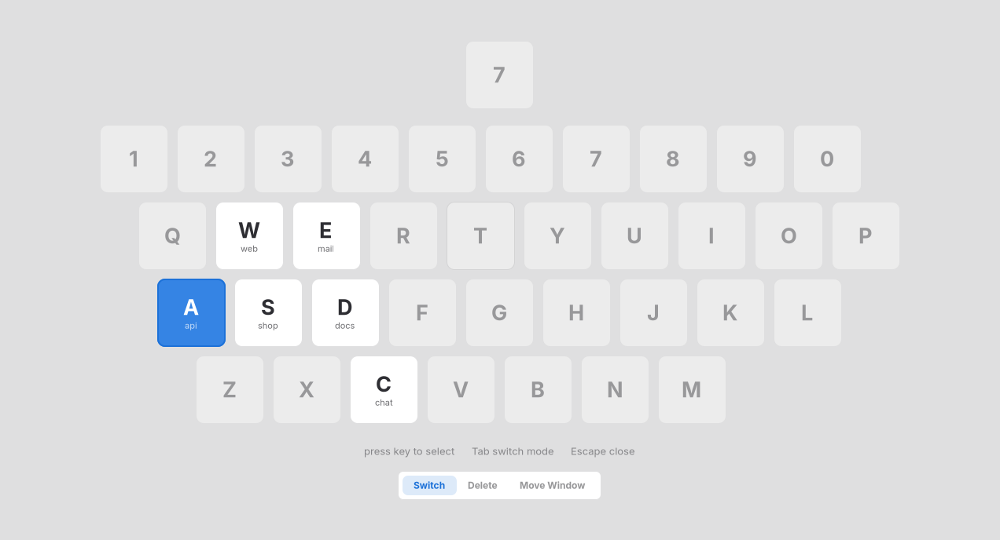

<!-- Generated by e2e/render-themes.sh; do not edit. -->
# Theme gallery

Set `general.theme` to one of the built-in names, or to the path of a CSS
file. See [Theming](../README.md#theming) for the variables and classes.

## gtk, under a dark GTK theme

```toml
[general]
theme = "gtk"
```



## gtk, under a light GTK theme

```toml
[general]
theme = "gtk"
```



## dark

```toml
[general]
theme = "dark"
```


<details>
<summary><code>themes/dark.css</code></summary>

```css
/* A neutral palette that ignores the GTK theme. */

window {
    --bg: #222226;
    --fg: #ffffff;
    --accent: #3584e4;
    --urgent: #cd9309;
    --danger: #ff7b63;

    --accent-fg: #ffffff;
    --accent-text: #78aeed;
    --urgent-fg: rgba(0, 0, 0, 0.8);
}
```

</details>

## light

```toml
[general]
theme = "light"
```



<details>
<summary><code>themes/light.css</code></summary>

```css
/* A neutral palette that ignores the GTK theme. */

window {
    --bg: #fafafb;
    --fg: #2e2e33;
    --accent: #3584e4;
    --urgent: #e5a50a;
    --danger: #c01c28;

    --card-bg: #ffffff;
    --accent-fg: #ffffff;
    --accent-text: #1c71d8;
    --urgent-fg: rgba(0, 0, 0, 0.8);
}
```

</details>
